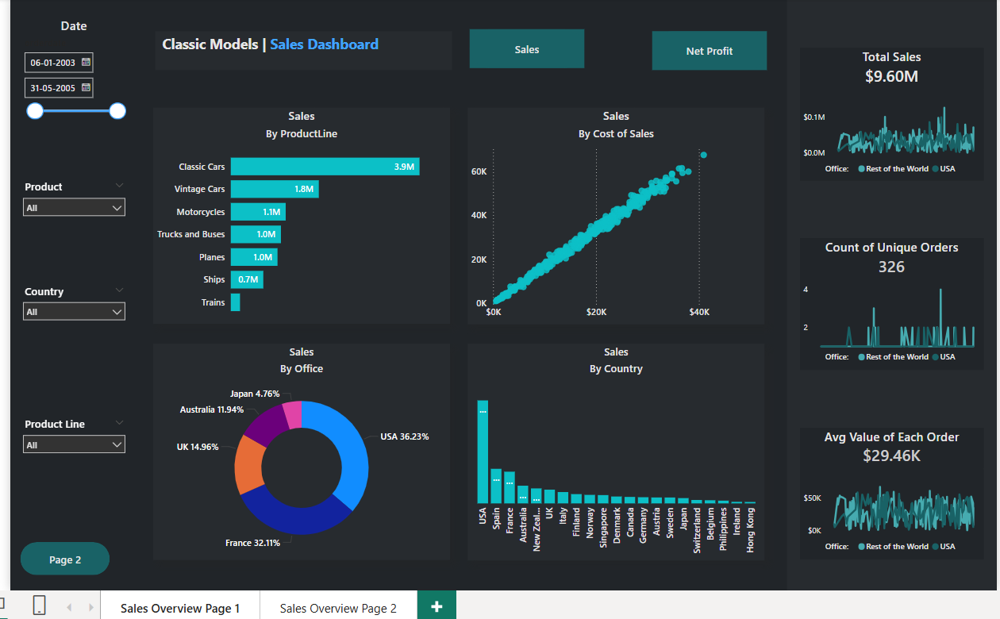
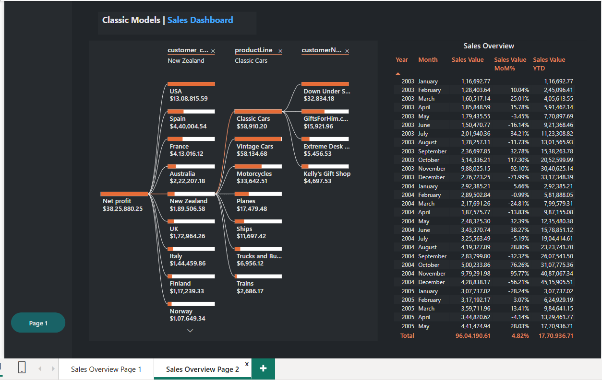
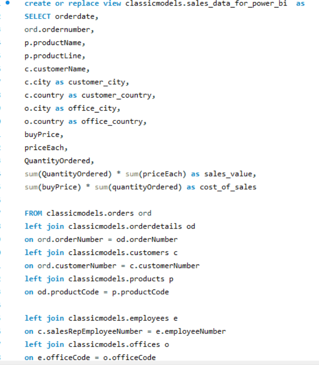

# MySql-Power-BI--Classic-Model-Dataset
This project presents a Sales Analysis Dashboard built using Power BI based on the Classic Models dataset. The dashboard offers detailed insights into global sales performance across multiple product lines, countries, offices and customers. The goal is to support better business decisions with interactive visuals and KPIs.

  
  
  

## 🧾 Dataset Description

The dataset originates from the **Classic Models** database, a commonly used sample dataset in SQL tutorials. It includes data from the following tables:
- `Customers`
- `Orders`
- `OrderDetails`
- `Payments`
- `Products`
- `Employees`
- `Offices`
- `buyprice`
- `priceeach`
- `QuantityOrdered`

These tables were **imported into MySQL**, joined via SQL **views**, and then connected to **Power BI** for analysis.

---

## 🔁 Data Transformation in Power BI

- Connected to **MySQL database** using Power BI connector.
- Created a **calendar table** using DAX to enable filtering by year, month, and date.
- Built **relationships** among tables using the appropriate primary and foreign keys.
- Created **measures** for key metrics:
  - Total Sales
  - Net Profit
  - MoM % Growth- Month on Month Growth
  - YTD Sales
  - Unique Orders
  - Avg. Order Value
  - Used `SWITCH()` function to dynamically toggle between **Sales** and **Net Profit** views in the dashboard.

---

## 📊 Dashboard Pages

### 🔹 Page 1: Interactive KPIs and Visualizations

- Toggle between **Sales** and **Net Profit**
- Sales by:
  - Product Line (bar chart)
  - Country (column chart)
  - Office (donut chart)
  - Cost of Sales (scatter plot)
- Key KPIs:
  - Total Sales: `$9.60M`
  - Unique Orders: `326`
  - Average Order Value: `$29.46K`

### 🔹 Page 2: Decomposition Tree & Sales Overview Table

- **Decomposition Tree**: An interactive visual to drill down into metrics by country, product line, and customer.
- **Sales Overview Table**: Monthly view of:
  - Sales Value
  - MoM Growth %
  - YTD Accumulated Sales

---

## 🔍 Key Insights

1. **Top-Performing Product**: `Classic Cars` lead with `$3.9M` in sales.
2. **Country-wise Sales**:
   - `USA` leads with ~36% of total sales.
   - `France`, `UK`, and `Australia` also show strong performance.
3. **Office-wise Breakdown**:
   - `USA Office` contributes the most, followed by `France` and `UK`.
4. **Seasonal Trends**:
   - High MoM growth in `Oct 2003` and `Mar 2005`.
   - Sales dipped in early 2005 but recovered by `May 2005`.

---

## ✅ Recommendations

- **Expand in USA & France**: Given their high contribution, more regional offices or marketing campaigns could boost revenue.
- **Focus on Classic & Vintage Cars**: These are the best-selling product lines and should be prioritized.
- **Optimize Low Performers**: Countries like `Switzerland` and `Hong Kong` show minimal sales — consider market research or withdrawal.
- **Sales Forecasting**: Implement time-series forecasting for inventory and revenue planning.
- **Cost Management**: Analyze the scatter plot on cost of sales to identify anomalies and control costs.

---
